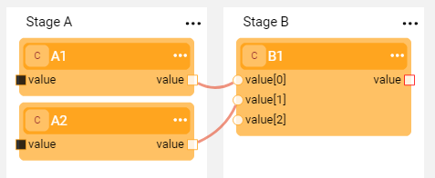
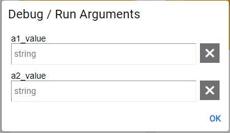

# Example of Using Actors in Flows

### Setting and Updating Links Between Actors, Remarks and Population Types

1. Create a new Broadway flow as explained in the [Building a Simple Broadway Flow](05a_create_broadway_flow_example.md#example---building-a-simple-broadway-flow) example. 

2. Add two **Const** Actors named **A1** and **B1** to two different Stages of the flow. Set the input of **A1** to a value and change the input of **B1** to the **Link**  population type. Then draw a link between the Actors as explained in [Linking Actors](/articles/19_Broadway/07_broadway_flow_linking_actors.md). Verify that the connection's **Link Type** = **Value** (default). 

3. Click the connection line to set the **Varargs** to **ON**, add **Const** Actor **A2**, connect it to the input of **B1** and run the flow to check the impact.

4. Create another flow by adding the **ConstStrings** Actor and **StringBuild** Actor  to two different Stages. Populate the input of the  **ConstStrings** Actor using the array of strings. Set the Link Type between the Actors to **Iterate** and run the flow.

5. Then change the Link Type to **First** and run the flow again to check the impact. 

   For more information about handling loops in Broadway, refer to [Broadway Iterations](/articles/19_Broadway/21_iterations.md). 

6. Delete the link's connection line.  

7. To add a connection, click  in the source Actor's context menu > **Link**. For more information, refer to the [Actor Context Menu](/articles/19_Broadway/18_broadway_flow_window.md#actor-context-menu).

8. Click the **A1** Actor and then click  in the Actor's context menu > **Show only connected** to display only the Actors linked to **A1**. For more information, refer to [Show Only Connected](/articles/19_Broadway/08_show_only_connected_actors.md). Click **Show only connected** again to return the links.

9. Click  in the Actor's context menu > **Remark** and add a remark.

10. Click  in the Actor's right corner to open the Remark pop-up, remove the text and close it to delete the remark.

11. Change the population type of the **A1** and **A2** Actors input arguments from **Const** to **External** and then update the argument's external name to **a1_value** and **a2_value**. For more information about Actors population types, refer to [Actor Inputs and Outputs](/articles/19_Broadway/03_broadway_actor_window.md#actors-inputs-and-outputs).

12. Run the flow in Debug mode when Debug is set to  ON. The Debug / Run Arguments window pops up to insert the flow input arguments.

13. Populate the values and click **OK** to run the flow. 

14. To run the flow with different input arguments, click **Actions** > **Debug** / **Run Arguments** in the main menu toolbar and insert other arguments for  **a1_value** and **a2_value**. Then run the flow.

Let's continue to the next item and learn about frequently used built-in Actors.

