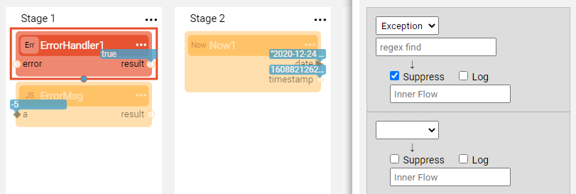
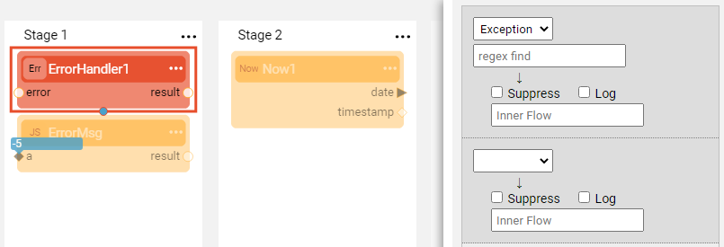

# Additional Broadway Features

###  Solution

1. Actor Inheritance:
    a. Yes, the inherited Actor can be used in any other flow.
    b. Select <strong>Export Actor</strong> from the inherited Actor's context menu and update the definition of the arguments. 
    For example, change the <strong>tz</strong> input argument from <strong>hidden</strong> to <strong>empty</strong>, click the <strong>override current</strong> checkbox and submit.

2. Inner Flow and Error Handling:
    a. It is not the only way since the Error Handler can be defined using any Actor. 
    For example, the described validation can be performed using the <strong>GreaterThanEquals</strong> Actor.
    b. When an error handler returns false, the flow stops. Thus when <strong>a</strong> is negative, the flow stops before the <strong>Now</strong> Actor is invoked.

  c. Modify the flow as follows:

  * Remove the existing error handler and add a new one by selecting the **ErrorHandler** Actor. 

  * Modify the ErrorMsg **JavaScript** Actor to include the following script:

    ~~~javascript
    if (a < 0) {
        throw "A Can't be negative!";
    }
    ~~~

  * Run the flow once while suppressing the exception via the **ErrorHandler** Actor and again without suppressing it.

  * When the error is suppressed, the flow continues until the end.

  * When the error is not suppressed, the flow fails.

3. Transactions:
    When an error handler returns false, the flow stops and the transaction ends with a rollback. 
    Thus when <strong>a</strong> is negative, the flow stops and the transaction is rolled back.

