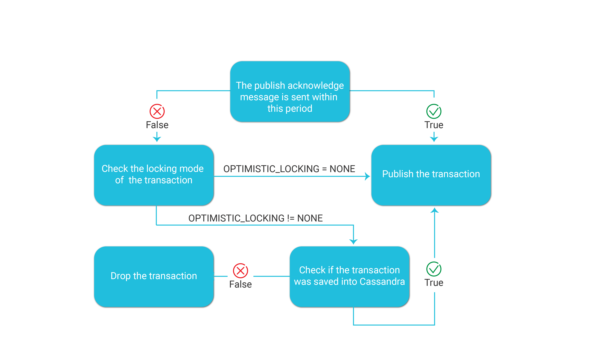

# CDC Process Architecture

The Fabric CDC process aggregates LUI data updates in the [MicroDB](/articles/02_fabric_architecture/01_fabric_architecture_overview.md#211-microdb-) and publishes a CDC message to the CDC consumer about committed changes. 

The following diagram describes the CDC process:

### MicroDB Update

A transaction on an LUI may involve several updates in several of its LU tables. Each update (write) in the MicroDB SQLite file of the LUI activates a Fabric trigger that sends the change to the **CDC Message**. The CDC Message publishes a message to Kafka for each insert, update, or delete event in the MicroDB. Each message has the LUI (iid), event type, old and new values of each CDC column, PK columns of the LU table and transaction ID.

-  If the transaction is committed, a **Commit message** is sent by the **CDC Message**. 

-  If the transaction is interrupted, rolled back or failed, a **Rollback message** is sent by the **CDC Message**. 

### CDC Message

The CDC Message publishes transaction messages to **Kafka**  for each UPDATE, INSERT or DELETE activity. Kafka uses the **CDC_TOPIC**  topic name for keeping transaction messages. The partition key is the LUI (iid).

### CDC Publisher

When the MicroDB is saved into Cassandra, the transaction's thread sends a **Publish Acknowledge**  message to the Kafka **CDC_TOPIC** when the MicroDB is saved to Cassandra. 

The CDC_TRANSACTION_PUBLISHER job consumes the transaction messages from Kafka and creates a [CDC message](02_cdc_messages.md) for each transaction. Each CDC consumer has its own Kafka topic.

#### TRANSACTION_ACKNOWLEDGE_TIME_SEC Parameter

The Fabric [config.ini](/articles/02_fabric_architecture/05_fabric_main_configuration_files.md#configini) file defines the following parameter which sets the maximum waiting time between the commit of the transaction and the Publish Acknowledge message which is sent when the transaction is successfully saved into Cassandra: 

- TRANSACTION_ACKNOWLEDGE_TIME_SEC=60

The default value of this parameter is 60 seconds.

The following diagram displays how Fabric handles this parameter:

Note that the [OPTIMISTIC_LOCKING](/articles/23_fabric_transactions/02_fabric_transactions.md) parameter in the config.ini can be set per node to support lightweight transactions between nodes when saving the LUIs into Cassandra.

### CDC Consumer

Fabric has built-in integration with Elasticsearch. The CDC_TRANSACTION_CONSUMER jobs starts automatically when deploying an LU with Search indexes. The Jobs UID is **Search**. The CDC consumer job consumes the messages in the Kafka **Search** topic and creates search indexes in Elasticsearch.

[Click for more information about Fabric Search capabilities](cdc_consumers/search).

### CDC Transaction Debug 

The **DEBUG_CDC_JOB** Fabric job can be run as a CDC consumer to debug a CDC topic whereby it consumes the CDC messages of a given CDC topic and writes them to the log file. 

Example: 

startjob DEBUG_CDC_JOB name='DEBUG_CDC_JOB' ARGS='{"topic":Tableau", "partition": "0", "group_id": "tableau"}';

