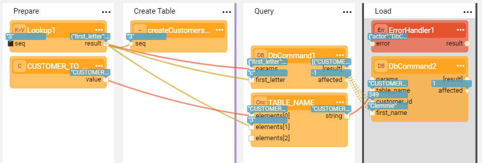

# Recovery Point

### Overview

Broadway is a Fabric module designed for data movement across various systems, such as populating Logical Units with data from external sources, moving data from Fabric to external systems or consuming messages. Broadway flows and jobs can serve complex systems with hundreds of transactions executed every second. If a flow fails or crashes amid transactions, it should be able to recover lost data.

Setting a **Recovery Point** in a Broadway flow allows to mark one or more Stages at which the flow data should be serialized and saved in the **broadway_recovery_point** Cassandra table under the [k2system keyspace](/articles/02_fabric_architecture/06_cassandra_keyspaces_for_fabric.md). Then if a flow fails, the flow can be re-run from the last saved recovery point rather than from the beginning using the same data.  The flow recovery is enabled only if the **recovery ID** is supplied to the Broadway command.

### How Do I Set a Recovery Point?

Click > **Recovery Point** in the [Stage context menu](18_broadway_flow_window.md#stage-context-menu) to display a thick divider line. Repeat the same in additional Stages if more than one Recovery point should be set in the same flow. Note that setting a recovery point inside the loop is not supported. 

### How Do I Run the Flow with Recovery Point?

The flow can be executed in one of the following ways:

* By running the flow using a [BROADWAY command](/articles/02_fabric_architecture/04_fabric_commands.md#fabric-broadway).
  * When running a Broadway command, it is mandatory to provide a recovery ID in order to enable the Broadway recovery mechanism. Then if the flow fails, re-run the same flow with the same recovery ID.
* By running a [Broadway job](/articles/20_jobs_and_batch_services/05_create_a_new_broadway_job.md) using the STARTJOB command. 
  * When running a Broadway job, it is not required to provide a recovery ID since the recovery mechanism is enabled automatically for the jobs.
* By running a flow from the Fabric Studio - ?????

