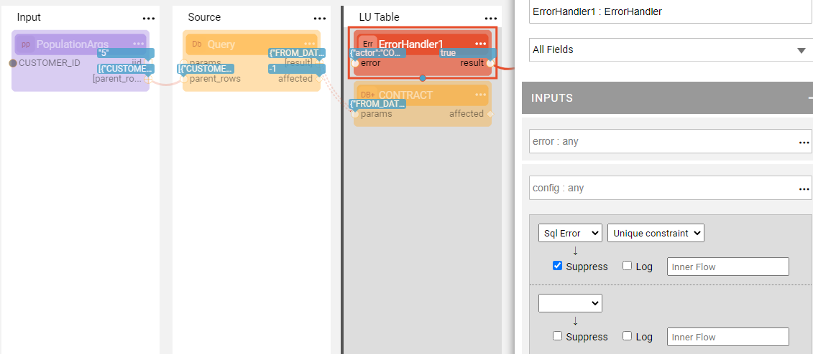
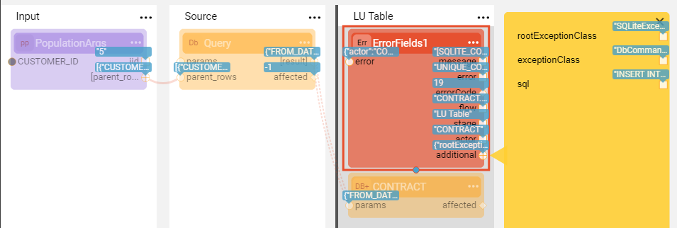

# Error Handling Actors

Broadway has a built-in error handling mechanism that handles exceptions in a flow using **Error Handlers**. An error handler is defined using a Broadway Actor. Any Actor or an [Inner flow](/articles/19_Broadway/22_broadway_flow_inner_flows.md) can act as an error handler. 

This article describes the advanced error handling features provided by an **ErrorHandler** and an **ErrorFields** Actors.

For basic Broadway error handling mechanism, refer to [Error Handling article](/articles/19_Broadway/24_error_handling.md).

### How Do I Use the ErrorHandler Actor?

The **ErrorHandler** Actor can be used as an Error Handler to enable different handling of various exceptions. You can configure it to suppress one kind of exceptions and not to suppress other types or to invoke an Inner flow when an exception is thrown. When the error is suppressed, the error handler returns **true** and the flow continues. 

The following example shows how to use an **ErrorHanlder** Actor as an Error Handler in the **LU Table** Stage. In the below configuration only the **Unique Constraint** SQL errors are suppressed. Any other error will cause the flow to fail. 

### How Do I Use the ErrorFields Actor?

The **ErrorFields** Actor can be used to get detailed information about the exception. The Actor can be used either as an error handler or in an Inner Flow to access the error information. The **ErrorFields** Actor always suppresses the exceptions. 

