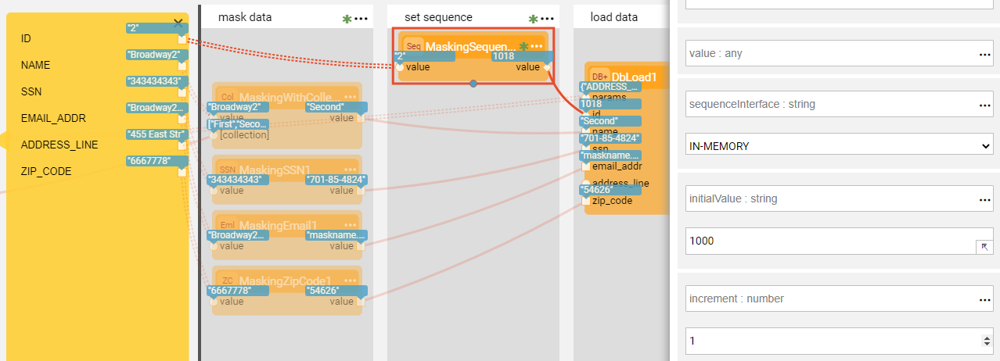

# Masking and Sequence Actors

Data Management Systems like **TDM** often handle sensitive data. To be compliant with Data Privacy laws, Fabric provides a **Masking** category of Actors that mask sensitive fields like SSN, credit card numbers and email before they are loaded into the target DB.

For example: 

* The **MaskingSSN** Actor masks the original SSN number with a valid fake SSN.
* The **MaskingCreditCard** Actor generates a fake but valid credit card number similar to the original one.

Note that if data needs to remain masked in Fabric, **masking** Actors can be used in Broadway population flows.

Another important functionality for systems that need to frequently load data to target DBs is the ability to generate and populate a unique Sequence ID.

The **MaskingSequence** Actor which also belongs to the **masking** category, generates a unique Sequence ID based on the provided input arguments.

<!--[Click for more information about TDM7 implementation]().  TBD !!!-->

### How Do I Set Masking Input Arguments?

**Masking** Actors have the following input arguments:

* **maskingId**, a unique masking identifier used to generate a target value. Since the same **masking** Actor can be used in several flows of the same project, use this parameter to refer to the same cache.
* Execution ID, generated in Fabric during each executed flow. Keep **useExecutionID** = **true** to generate a new masked value in each executed flow. When set to **false**, the same masked value is used across different executions.
* **hashedInputValue**, indicates whether to store the original or the hashed value. By default the hashed value is stored. To disable it and store the original value, set the **hashedInputValue** to **false**.
* **interface**, set this input argument to the interface to be used to cache the masked values. Cassandra or in-memory interfaces should be used for this purpose. 
  * When the Cassandra interface is set, the Cassandra **masking_cache** and **uniqueness** tables under the [k2masking keyspace](/articles/02_fabric_architecture/06_cassandra_keyspaces_for_fabric.md) are used to cache the masked values and to enable their uniqueness when required. The data kept in the tables reflects the setting in the Actor's input arguments.
* **verifyUnique**, determines whether different input values can be masked to the same masked value. The uniqueness is checked per Masking ID and Execution ID. Set this parameter to **true** if the masked value should be unique. For example, when masking an SSN, the masked value must be unique.

The following input arguments are specific to the **MaskingSequence** Actor:

* **sequenceInterface**, where the sequence is defined. The **MaskingSequence** Actor's **maskingId** setting holds the sequence name and must be defined in the **sequenceInterface** setting.
* **initialValue** and **increment**, define the initial value of the sequence and the value of increment. 

### How Do I Mask Data using Masking Actors?

The following example shows how to mask an Address description and  ZIP code using two **masking** Actors in the population flow. 

The same masking can be implemented in several flows of the same project. For example, if the ZIP code is populated in several LU tables in Fabric, use the same Actor in the flows and specify the same Masking ID.

### How Do I Use the MaskingSequence Actor?

The purpose of the **MaskingSequence** Actor is to enable the implementation of a sequence's solution when creating Broadway flows that load data into a target DB.

The following example shows how to use a **MaskingSequence** Actor to generate a new sequence for a Customer ID instead of the original one.

s
