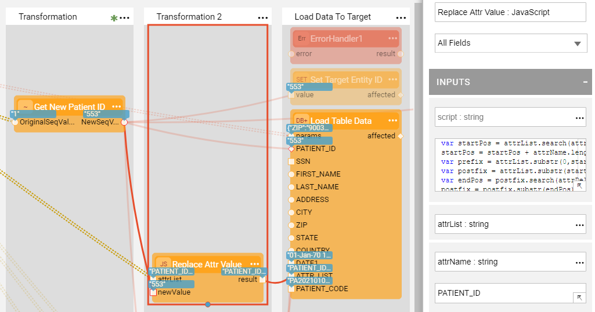
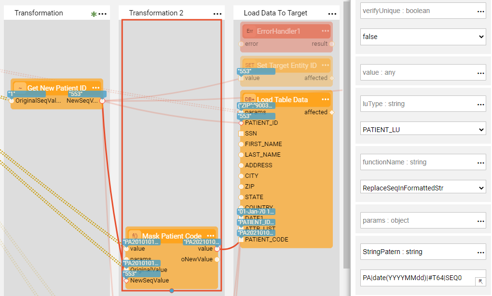
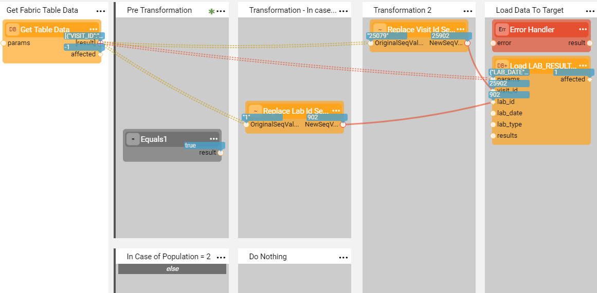
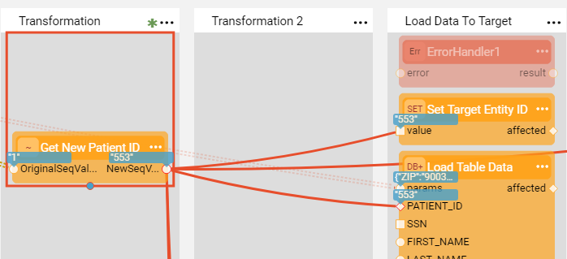

# Sequence Implementation Guide

Broadway provides a solution for generating and setting new sequences before loading data into Fabric or target database. Various sequence patterns can be implemented  via the **MaskingSequence** Actor and other Broadway features.

This article describes the most useful use cases of sequence implementation by Broadway.

### Sequence Caching

The frequent sequence implementation scenario is when the same sequence needs to be used per entity and execution across several flows. The following use cases of sequence caching are supported:

* Using a sequence across several tables of the same LU. For example, Customer ID is a sequential field in the CUSTOMER LU and it is populated in several LU tables such as CUSTOMER and SUBSCRIBER. 
* Using a sequence across different LUIs within the same LU. For example, the same ADDRESS ID can be used for different customers during the same execution.
* Using a sequence across different LU types. For example, the same CUSTOMER ID can be used in CUSTOMER LU and Billing LU during the same execution.
* Using a sequence across different DCs.

To implement the above use cases, set the unique **maskingId** and populate it on the **MaskingSequence** Actor in every place where the same sequence should be used. Keep the **useExecutionID** as **true** on each Actor's settings.

### Sequence Next Value

The sequence next value method depends on where the sequence is managed. It is determined by the **sequenceInterface** setting. The following use cases are supported:

* In-memory or Redis, useful to testing purpose only since it can be used only by a single node configuration.
* DB sequence. To implement it, set the **maskingId** to the sequence name that is defined in the **sequenceInterface** DB.  

### Sequence Initiation Method

Sequence initiation can be done using the **initialValue** and the **increment** settings of the Actor though it is relevant for in-memory or [Redis interface](/articles/24_non_DB_interfaces/09_redis_interface.md) only. In case of DB sequence, these attributes are managed by the DB. Note that the initial value is cached on the Actor's first execution. The following use cases are supported:

* Initialize the sequence using the constant initial value, for example 1000000.
* Initialize the sequence using another Broadway flow by setting the flow name in the **initialValue** argument. The Actor invokes the flow to calculate the sequence initial value. Note that the flow must return an external variable named **initialValue**. 

### Sequence Mapping

Broadway supports various ways how the sequence can be mapped. The following use cases are supported:

* Map the old to the new value.

  

* Set the sequence as part of the attribute list. To do so, generate the sequence and then create the concatenated attributes list using the [**JavaScript** Actor](01_javascript_actor).

   

* Set sequence in a specific format, for example SQ|date(Ym)|BR[value]|[new_seq]. To do so, generate the sequence and then use the **MaskingLuFunction** Actor to mask the input value with the result of LU function execution. The selection of the LU and the function is done in same way as when using an [**LuFunction** Actor](/articles/19_Broadway/09_broadway_integration_with_Fabric.md#lufunction-actor).

  

* Set sequence value based on condition, for example generate the sequence value only for some of the entries based on a given condition. To do so, define a [Stage Condition](../19_broadway_flow_stages.md#what-is-a-stage-condition) in the Broadway flow. 

  

* Replace the IID by a new sequence. This use case is the same as mapping an old value to the new one.

  

* When parent-child relation exist across the Logical Units, the same sequence can exist in both parent and the children. You can run the update flow on the parent LU to add the child sequence to it. For example, the Customer LU is a parent while the Order LU is a child. After the population of both Customer and Order LUs is completed, update the Customer LU with the sequence from the Order LU.

* Store the relation between the old and the new sequence. To do so, create a flow that will store these values in Cassandra **TDM_SEQ_MAPPING** table under the [k2masking keyspace](/articles/02_fabric_architecture/06_cassandra_keyspaces_for_fabric.md), for example for reporting purpose. 

* Clone the entities when required. Different sequence values are generated per each one of the cloned entity. This functionality is supported as part of TDM7 implementation. <!--add link to TDM7-->

