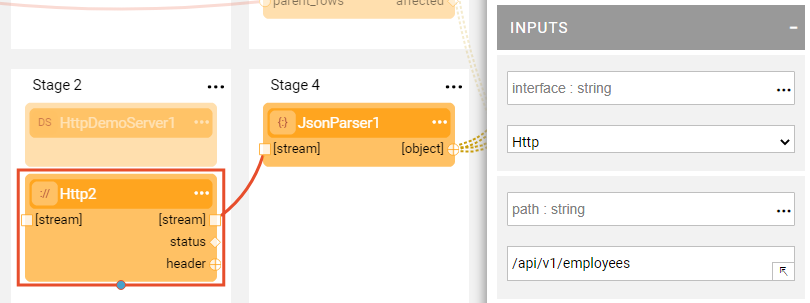

# HTTP Interface

The HTTP interface type defines the connections to an HTTP/s host and can be used by Broadway Actors.

To create a new HTTP interface, do the following:

1. Go to **Project Tree** > **Shared Objects**, right click **Interfaces**, select **New Interface** and then select **HTTP** from the **Interface Type** dropdown menu to open the **New Interface** window.

   

2. Populate the connection's settings and click **Save**.

### Connection Settings

<table>
<tbody>
<tr>
<td width="300pxl">&nbsp;<strong>Parameter</strong></td>
<td width="600pxl">&nbsp;<strong>Description</strong></td>
</tr>
<tr>
<td>&nbsp;<strong>Protocol Type</strong></td>
<td>&nbsp;Select between HTTP and HTTPs</td>
</tr>
<tr>
<td>&nbsp;<strong>Host</strong></td>
<td>&nbsp;Hostname or IP address of the HTTP server</td>
</tr>
<tr>
<td>&nbsp;<strong>Port</strong></td>
<td>&nbsp;Port of the HTTP server</td>
</tr>
<tr>
<td>&nbsp;<strong>Path</strong></td>
<td>&nbsp;(Optional) A specific within the Host endpoint</td>
</tr>
<tr>
<td>&nbsp;<strong>Authentication Type</strong></td>
<td>&nbsp;Access authentication type. The default value is "Basic". By selecting a type, other properties are revealed to be populated. For more information see below</td>
</tr>
</tbody>
</table>

##### Authentication Settings

Fabric HTTP Interface supports various standard authentication and authorization types, also known as schemes, when accessing to external protected resources. 

Each type requires several specific security and credentials definitions, which shall be supplied to the Fabric implementer by the resource provider and that shall be populated in HTTP interface properties. According to the type and the properties, Fabric makes all required authentication interactions with the remote vendor servers.

The supported types are: 

* ***Basic* HTTP Authentication** is built into the HTTP protocol. The client (Fabric) sends HTTP requests with the `Authorization` header that contains the word `Basic` followed by  \<user:password\> in base64-encoded form. 

  Accordingly, the properties for this interface are:

  * User
  * Password

  Note that since this mechanism does not provide confidentiality it is usually used over HTTPS and not HTTP.

* ***Bearer* Authentication** (also known as *token authentication*) is an HTTP authentication type/scheme that uses security tokens called bearer tokens. The bearer token is a cryptic string. The client (Fabric) sends this token in the `Authorization` header when sending requests to the resource. 

  Accordingly, the properties for this interface are:

  * token

* **OAuth 2.0 Password Credentials**  is one of the OAuth protocol's grant type flow. The client (Fabric) interacts first with an authorization server, supplying it user & password and gets back an access token. Then, the client uses the access token for the resource server calls. 

  Accordingly, the properties for this interface are:

  * User 

  * Password

  * Access Token URL - the address of the authorization server, which shall supply the access token

  * Client ID - shall be provided by the external resource/auth vendor. 

  * Client Secret - shall be provided by the external resource/auth vendor.

  * Scope (optional) - used to validate that the required scopes of actions are indeed permitted by the authenticating server. In turn, the authorization server uses the "scope" response parameter to inform the client of the scope of the access token issued. 
  The value of the scope parameter is expressed as a list of space-delimited, case-sensitive strings.

  * Token Timeout - request timeout toward the authorization server.

* **OAuth 2.0 Client Credentials** is another OAuth protocol's grant type flow. Fabric interacts first with the authorization server, supplying it client-ID and Client-Secret and gets back an access token. Fabric then uses the access token for the resource server calls.

  Accordingly, this interface properties at Fabric are:

  * Client ID - shall be provided by the external resource/auth vendor.

  * Client Secret - shall be provided by the external resource/auth vendor.

  * Scope (optional) - specify the scope of the access request using.  In turn, the authorization server uses the "scope" response parameter to inform the client of the scope of the access token issued. 

    he value of the scope parameter is expressed as a list of space-delimited, case-sensitive strings.

  * Token Timeout  - request timeout toward the authorization server

### Example of Using an HTTP/HTTPS Interface in a Broadway Flow

The above Broadway flow uses an **Http** Actor to connect to the HTTP server that populates the predefined HTTP interface into the **interface** input argument. The **path** input argument must be populated by the path relative to the interface. 
Note: HTTPS requests are included into this HTTP actor (for which security parameters are defined within the interface)  

 
