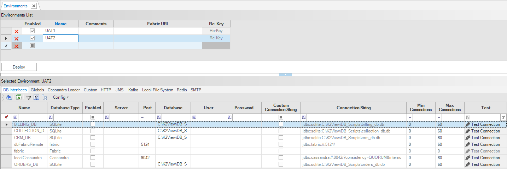

# Create New Environment

The environment is created in two steps:

* Creation of an environment via the **Environments List** grid and its deployment.
* Setting of all the interfaces relevant for the selected environment via the **Selected Environment** grid.

**Step 1 - Creation of the Environment**

1. Go to **Project Tree** > **Shared Objects** and double click on **Environments** to open the Environments window.

   

2. In the **Environments List** grid, populate a meaningful Environment name in the **Name** field.

3. (Optional) Populate the **Comments** field with environment description.

4. (Optional) In the **Fabric URL** field, select the server from the list predefined in the **Server Configuration** tab of the [**User Preferences**](/articles/04_fabric_studio/04_user_preferences.md) window. 

   * The selected Fabric node is used to encrypt the passwords of all the interfaces related to the given environment and to run the test connection. If the node is not selected, Fabric will use the local test connection and previous encryption algorithm - ???? 
   * [Click for more information about the Fabric security hardening].

5. Click **Re-Key** in order to use the most updated encryption mechanism and the latest master key to encrypt the interfaces passwords.

6. Deploy an environment to the Fabric server. The deploy of environments is separate to the deploy of LUT, Reference tables, and Web services. Note that the deploy of environments to Fabric can be done either by Fabric Studio or by using a command line to deploy environment from xml file.

Click for more information about [Environment Deployment from the Fabric Studio](03_deploy_env_from_Fabric_Studio.md) and about [Manual Deployment from XML File](04_manual_deployment_from_XML_file.md).

**Step 2 - Interfaces Settings per Environment**

Once **Name** in the  **Environments List** grid is clicked, all existing DB and non-DB interfaces of the project are copied to the **Selected Environment** grid and displayed in the tabs. Each interface type is displayed in a dedicated tab. For example, if the project has DB, SMTP, Kafka and HTTP interfaces, each type is displayed in a separate tab.

By default, all interfaces are enabled. Now you can update the settings of each relevant interface or disable it if not applicable for the environment.

1. Select the interface and enable or disable it to add to the environment or to remove from it by either:
   * Click the **Enabled** column.
   * Right click on the row and click **Set Selected Rows as Enabled** or **Set Selected Rows as Disabled**. Hold **Ctrl** key for multiple row selection. 
2. Populate the relevant fields for each active interface for the  **Selected Environment** grid: server. user, password, etc.
   * If the project has several interface types, do through the tabs tp populate all the mandatory fields.
3. Click **Save**.
   * Note that the environment cannot be saved when the sign appears in one of the fields indicating that mandatory field is not populated.

