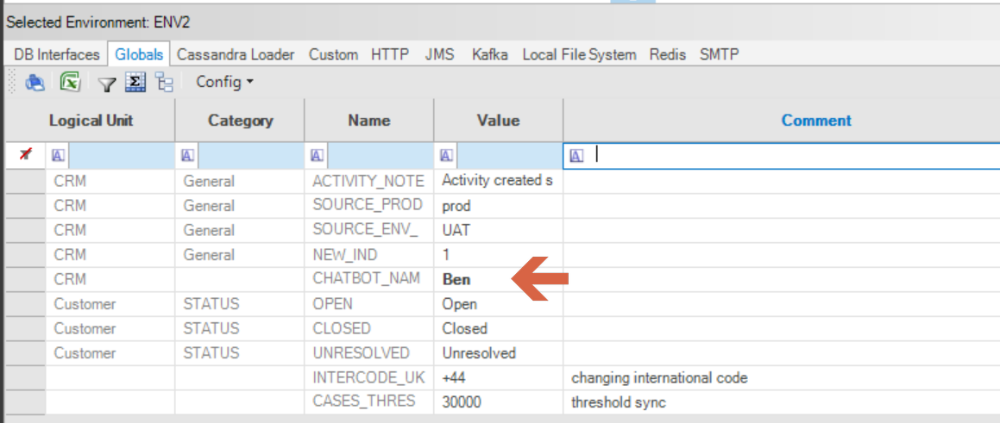
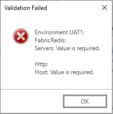

# Create and Edit Environment

An environment is defined in Fabric using the following steps:

* Creating the environment in the Fabric Studio using the **Environments List** grid.
* Populating the connection details of the interfaces via the **Selected Environment** grid.
* Overriding Globals in any of the levels - Shared, Reference or LUs via the dedicated tab at the **Selected Environment** grid.   
* Deploying all the environments to the server while defining the active environment.

When editing an existing environment, step 1 below shall be skipped.  

### Step 1 - Creating the Environment

1. Go to **Project Tree** > **Shared Objects** and double click **Environments** to open the Environments window.

   

2. In the **Environments List** grid, do the following:

   -  Enter a meaningful name for the environment in the **Name** field.

    - (Optional) In the **Comments** field add a description of the environment.

    - (Optional) In the **Fabric URL** field, select the server from the predefined list in the **Server Configuration** tab in the [**User Preferences**](/articles/04_fabric_studio/04_user_preferences.md) window. 

       The selected Fabric node is used to encrypt the passwords of all interfaces related to the given environment and to run the test connection. If the node is not selected, Fabric uses the local test connection and previous encryption algorithm. 

    Full explanation will be provided in the Fabric hardening knowledge base article.
        <!--[Click for more information about Fabric security hardening].-->
   
   -  Click **Re-Key** to use the most updated encryption mechanism and the latest master key to encrypt the passwords of the interfaces.

### Step 2 - Defining Interface Settings per Environment 

Once **Name** in the  **Environments List** grid is clicked, all DB and non-DB interfaces in the project are copied to the **Selected Environment** grid and displayed in the tabs. Each interface type is displayed in a dedicated tab. For example, if the project has DB, SMTP, Kafka and HTTP interfaces, each type is displayed in a separate tab.

By default, all interfaces are enabled whereby the settings of each relevant interface can be disabled if it is not applicable for the environment.

1. Select the interface and enable or disable it for the environment by either:
   * Clicking the **Enabled** column checkbox.
   * Right clicking the row and clicking **Set Selected Rows as Enabled** or **Set Selected Rows as Disabled**. Hold the **Ctrl** key to select multiple rows. 
2. Populate the relevant fields of each active interface in the  **Selected Enviדronment** grid: server, user, password, etc. If the project has several interface types, go through the tabs and populate all mandatory fields.

   

### Step 3 - Overriding Globals per Environment

In addition to the interfaces that are copied automatically to the created environment, ready for updates, the Globals can also be overridden, per environment, via the Globals' tab. 

The Globals tab grid contains the following columns:

* Logical Unit [read-only, grayed-out], indicates if this is a Shared Object variable or associated to a specific unit/scope. 
  * For *LU* it is shown with the LU name, for *References* it appears as "k2_ref" and for Shared Objects this column will be empty).
  * If Global is defined both at Shared Objects and at LU, it will appear twice, accordingly.
* Category [read-only, grayed-out], shows its category as it was originally defined (if at all)  
* Name  [read-only, grayed-out], shows the variable name
* Value - shows the value which is set for this environment. As long as not changed - Globals inherit the origin implementation value. Once a Global value is changed - it shown in a bold form as illustrated below.
* Comment, recommended to be used for explaining why it was changed for this environment.

To **edit** the Global variable value: Type in the new value for the required Global variable. Once a Global value is changed - it will be shown in a bold form (also when opened this window later).

To **revert** the changes - click on the left-hand gray area of the Global variable entry. Once the entry is shown as "selected" right click and choose to "Reset To Original Values". 

Notes:

1. Only *non-final* Globals are shown at this Globals environment's table, because those that are defined as final are anyway not changeable. 
2. Globals variables values can be overridden per environment but creating new Global variables per environment is not available.
3. If a change was done in the implementation, for example - adding a new Global at *Shared Objects*, the the Environment window shall be closed and reopened, in order to see it reflected in the Globals' grid table.

### Step 4 - Deploying the Environments

Repeat steps 1-3 to create the required environments and then do the following:

1. Save the environments definitions:

   * The environment cannot be saved when  is displayed to indicate that a mandatory field is not populated.

   * If the mandatory settings are missing, the validation error message popups up:

     

2. Click **Deploy** to deploy an environment to the Fabric server. Unlike the interfaces, the environments are not deployed together with an LUT, Reference tables and Web Services and require an explicit deployment.

   Note that environments can be deployed to the Fabric Server either by the [Fabric Studio](03_deploy_env_from_Fabric_Studio.md) or by using a command line to perform an [offline deployment](04_offline_deployment.md) from an XML file.

