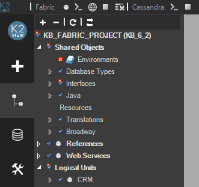

# Web Framework Overview

K2View Web Framework is a container for hosting multiple web applications and providing services out of the box. The purpose of the K2View Web Framework is to improve the system's usability by providing one unified tool with the links to several frequently-used web applications running on the same application server. Instead of manually typing the URL for opening each one of the applications, the user logs into the K2View Web Framework and selects the required application from the context menu. 

The framework can be opened using the following URL: **http://[Fabric IP address]:[Fabric port]/app/login**, for example http://localhost:3213/app/login or using the  icon from the Fabric Studio's toolbar:

### How Can I Integrate an Application into the Framework?

K2View Web Framework includes several [pre-integrated applications](02_preintegrated_apps_overview.md) (such as Admin or Swagger). Additional applications can be easily integrated into the framework with minimal development effort by adding the application name to the **apps.json** and a folder with the application's code into the Fabric's installation folder in Widows at: **K2View\Fabric_[version]\Server\fabric\staticWeb**. 

The order of the applications in the context menu list is determined by the order in the **apps.json**. 

The framework exposes a **k2api** object with various methods to be used by the application, such as navigation, Fabric commands, Web Services invocation, etc.  The application style can be set either using K2View Web Framework style sheets (**k2.css**) for having unified look & feel or by a different set of style sheets. The framework supports any application type (multi page or single page) and any routing method (History API, hash base or regular links).

The detailed API documentation can be found under K2View Web Framework > Documentation and it provides the development guidelines, the description of the supported methods and the code examples.

