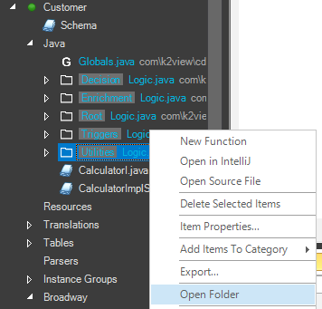
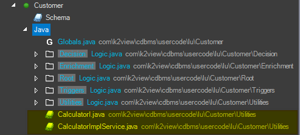

# Invoking a SOAP Call

### Introduction

SOAP is an XML based messaging protocol, used for web services. While many services these days moved to work with REST with JSON, some enterprise systems, especially at the Billing and CRM arena, are still using it . In addition, few common services are still working with SOAP such as SAML.

SOAP handling starts with analyzing the WSDL (stands for Web Services Description Language). It is an XML based document that describes the web service, specifying the location of the service, its methods, data types, what parameters it expects, and what data structures it returns. 

In this article we will explain the recommended implementation and best practice steps and will go thru an example which demonstrate the steps and the SOAP usage end-to-end.

### Preparations

Due to the WSDL complexity, it is recommended to use ready made Java code or libraries. Note that such supportive code is dedicated per web service and it is not  generic.

There are 2 options when integrating with SOAP service provider:

* The service provider supplies the JAR that contains the relevant code. It usually already contains the service endpoint and authorization keys. In such case, the JAR shall be located and used following the external jar usage instruction, explained [here](/articles/31_external_resources/01_external_jars.md). 

* The service provider publishes the service's WSDL, either as URL or a supplied file, where client shall learn it. For such cases we can use a JDK special command line tool called `wsimport`, aimed to reduce the hassles, by making the discovery of the WSDL, "translating" it into Java code form - the SOAP Client code.

Following we will describe the second case, where service is published with WSDL, and we will explain the preparation steps, before can be used at Fabric functions code. When using a provided JAR these steps are not required.

#### 1. WSDL Discovery: Generating SOAP Client Code

The SOAP client code generating is done by the JDK `wsimport` command which expects this syntax: `wsimport [options] <wsdl>`.  

The WSDL path parameter can be a URL or a file at the local file system, depended on how the service provider exposed it. 

It is recommended to use the following command options:

* `-Xnocompile`: indicate to not compile the generated Java files (it is redundant - the build is done at Fabric deployment process).
* `-keep`: keep the generated Java file
* `-p`: package name. 

For more options, available for this command, please see [here](https://docs.oracle.com/javase/7/docs/technotes/tools/share/wsimport.html).

The outcome when running this command is a new package, containing 2 Java files, one of them is an interface and the other one is the "service". These files contain java methods that can be used smoothly, in Fabric code, without being aware of the protocol or format, SOAP XML in this case. The file names are derived from the names in WSDL.

**Note**: the generated code is using the JAX-WS built in JAVA library. There is no need to use an external JAR.

#### 2. Copying the generated files into Fabric folder

In this step we copy the generated files, from step 1, to the required location at Fabric.  

* Find the right Java area at Fabric Studio tree.  You can create a dedicated *category* for this purpose.
* Right click on it will open a context menu with the "Open Folder" option, similar to the following:



* Copy the generated files from step 1 to the opened Windows Explorer. Copy only the files **without** all generated directories hierarchy.
* After copying the files they will be shown at the Fabric Studio Tree at the relevant Java area (yet, not under the *category*)

#### 3. Update & Verify Service address URL

The WSDL contains the service address. This is auto populated at the generated Java files.

Sometimes the supplied WSDL does not contain the actual service address, and it shall be updated.

Open the service file and look for the URL value. Verify or update the value.

### End To End Example

In our example, we are going to use a web service named "Calculator" that provides base math operations - *add, subtract, multiple* and *divide*.

We will follow the preparation steps, which described above.

1. **Generate the SOAP client Java files**

   In our example the WSDL path is supplied as a URL endpoint (refers to a localhost service):

   `wsimport -Xnocompile -keep -p com.k2view.cdbms.usercode.lu.Customer.Utilities http://127.0.0.1:10000/calcServer?wsdl`

   The WSDL which is used at this example can be also found [here](/articles/31_external_resources/calculator.wsdl).

   As can be shown in the `-p` package option at the command, we are going to use this service at a specific LU. While it can located and used elsewhere, also at project's shared area, in many cases the web service is LU oriented and thus better to be located there.

   We choose to locate it at *Utilities* functions category/directory. 

2. **Copy the generated files into Fabric folder**

   Following the preparation steps, which explained above, the Fabric Studio Tree is going to be as illustrated below (yellow highlighted)

   


3. **Update & Verify Service address URL**

   The generated code in the example refers to localhost, where are also running the test demo web service, so we do not need to change it.

4. **Use the Generated Code**

   Now we are ready to use the generated code for calling the SOAP service. The available methods can be found at the generated interface file.

   In our example, the generated code contains 4 methods - "add", "divide", "subtract", "multiply".

   Following is a code example of a utility function which use it. It get 3 input parameters - the operation and the 2 operand numbers. its output is the calculation result:

   ```java
   CalculatorImplService service = new CalculatorImplService();
   CalculatorI calc = service.getCalculatorImplPort();
   
   int result = 0;
   if (operation.equals("add")) {
   	result = calc.add(operand1, operand2);
   } else if (operation.equals("subtract")) {
   	result = calc.subtract(operand1, operand2);
   } else if (operation.equals("multiply")) {
   	result = calc.multiply(operand1, operand2);
   } else if (operation.equals("divide")) {
   	result = calc.divide(operand1, operand2);
   }
   log.info("result: " + result);
   return result;
   
   ```

   The first 2 lines initiate the generated code.

   
   
   To see and feel it in action, we can create a LuFucntion Actor at Broadway, which uses this function, as illustrated below:

