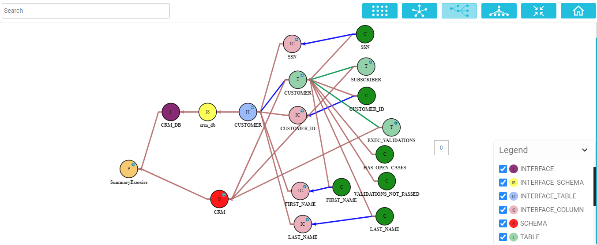

# Data Catalog Overview

Fabric Data Catalog is a graphical tool that visualizes the data structure, relationships and data flow within the Logical Unit. 

The Data Catalog describes how an organization collects, transforms and stores its data inventory. Due to its user-friendly UI, the catalog enables users to follow a data flow from its source to its target and by that drastically increases a user’s comprehension of an organization’s data model. For example, when developing a Web Service, it can assist to clarify the source system of the Web Service’s required output fields.

Moreover, the solution answers data privacy requirements for compliance with GDPR, CCPA and other global data protection regulations by enabling users to know how Fabric brings data from source systems, where in Fabric it is stored and how it is published externally.

### Data Catalog Components

The Data Catalog introduces a list of data entities with relations between them. The data entities are Project, Interface, Schema, Table, Column, etc. 

The data relations indicate the connections between the data entities that determine their hierarchy. For example:

* *{Interface} CONTAINED in a {Project}*
* *{Schema} CONTAINED in a {Project}*
* *{Api} USE a {Table}*

The entities and the connections between them are used to parse the data, analyze it and display it from the Project level, through the Schema to the API and Table fields level. 

The solution has a [Build Catalog](03_build_catalog_from_Fabric_Studio.md) option that creates a JSON files representing an entire project.

