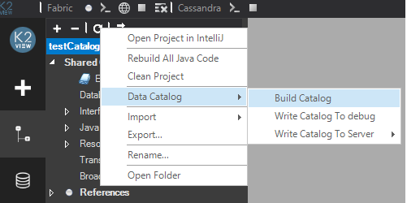

# Build and Write Catalog from Fabric Studio

The Data Catalog implementation must be deployed to the server side so that all changes are compiled and ready to be used. This is done using one of the following options in the Fabric Studio:

* **Build Catalog** option builds the catalog files for all the project entities (each LU, WS, Common). 
  * The files are created in JSON format in the Resources folder of the project entities  - one file per each project entity. 
  * All the files are named **auto.catalog**, except for the file created under Shared Objects that is named **shared.catalog**. 
  * The catalog supports [overriding the automatic files](06_override_data_catalog.md) to include the elements that don't exist in the project implementation.

* **Write Catalog** option deploys the Catalog to the server and it includes building the catalog files for all the project entities (each LU, WS, Common) and uploading them to OrientDB. 
  * Once Write Catalog is completed, you can login to the K2View Web Framework and navigate it. 
  * Note that Write Catalog can also be performed by running the [CATALOG WRITE](08_catalog_commands.md) command on the Fabric Server. In this case, the automatic files should be created prior to running the command using the Build Catalog from the Fabric Studio.

### How Do I Build the Catalog?

1. In the Fabric Studio right click the **Project** and select **Data Catalog > Build Catalog**. 

   

2. Build is executed and the results are displayed in the popup screen indicating the status for each project entity (LU, WS, Common). 

   * In case of issues, the error will be displayed in the popup screen.

3. Open the created catalog files. For example, to open the catalog file of the WS:

   * Go to **Web Services > Resources** and double click on **auto.catalog**.

### How Do I Write the Catalog?

1. In the Fabric Studio right click the **Project** and select **Data Catalog > Write Catalog To debug** or **Write Catalog To Server**. 
2. Alternatively, run the [CATALOG WRITE](08_catalog_commands.md) command on the Fabric Server.
3. Write is executed and the results are displayed in the popup screen indicating the status for each project entity (LU, WS, Common). 
   * In case of issues, the error will be displayed in the popup screen.

Note that you must perform **Write Catalog** in order to apply your catalog changes to the server.

### Example of Catalog Creation Process

1. Create a new project or use an existing one, for example **testCatalogDB** project with the **Customer** LU, WS and Reference tables.

2. Create a  [Data Catalog interface](04_data_catalog_interface.md) called **catalogdb**.

3. [Install OrientDB](07_OrientDB_setup) and start it.

4. Right click the **Project** and select **Data Catalog > Write Catalog To debug**.

5. Logic to the Data Catalog using the K2View Web Framework to navigate the catalog:

   

 