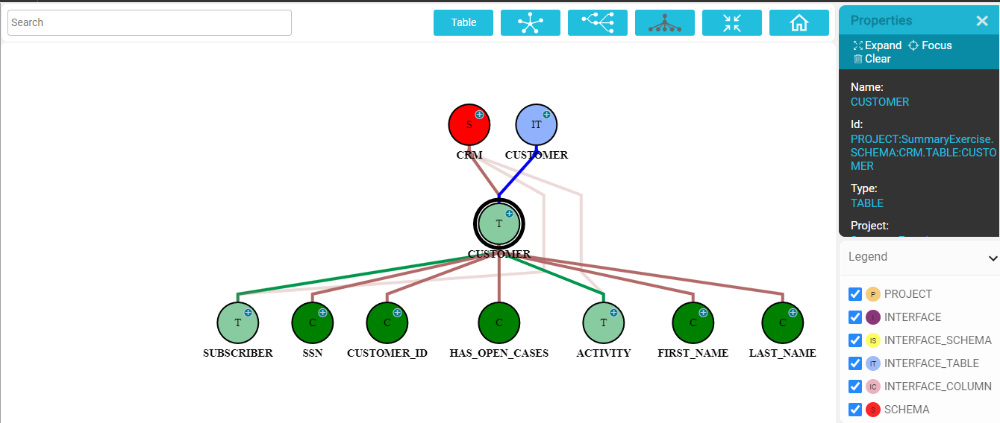

# Data Catalog Navigation

The Data Catalog UI enables users to move through a data model’s graph, move from one level to another and to filter specific elements.  

### How Do I Access the Data Catalog?

The Data Catalog is accessed from the [K2View Web Framework](/articles/30_web_framework/01_web_framework_overview.md). Select the **Data Catalog** application from the Web Framework context menu to display the circle representing your project. If multiple projects have been deployed to the same OrientDB database, all projects are displayed.

### Data Catalog Legend

The Legend is displayed on the bottom right corner of the screen and provides a visual description of each component in the graph. The graph's data types can be split into the following categories:

<table style="height: 116px; width: 750px;">
<tbody>
<tr style="height: 18px;">
<td style="width: 150px;"><strong>Category</strong></td>
<td style="width: 200px;"><strong>Data Type</strong></td>
<td style="width: 400px;"><strong>Description</strong></td>
</tr>
<tr style="height: 18px;">
<td style="width: 120px;"><strong>Project</strong></td>
<td style="height: 18px; width: 226px;">PROJECT</td>
<td style="height: 18px; width: 308px;">Project name.</td>
</tr>
<tr style="height: 18px;">
<td style="width: 120px;"><strong>Source Components</strong></td>
<td style="height: 18px; width: 226px;">INTERFACE INTERFACE_SCHEMA INTERFACE_TABLE INTERFACE_COLUMN</td>
<td style="height: 18px; width: 308px;">Data source components.</td>
</tr>
<tr style="height: 28px;">
<td style="width: 120px;" rowspan="3"><strong>Target Components</strong> <strong> </strong><strong> </strong></td>
<td style="width: 226px; height: 28px;">SCHEMA</td>
<td style="width: 308px; height: 28px;">

Project entity (LU, Web Services or Common).

</td>
</tr>
<tr>
<td style="width: 226px;">TABLE, COLUMN</td>
<td style="width: 308px;">

LU tables and columns.

</td>
</tr>
<tr>
<td style="width: 226px;">API, API_FIELD</td>
<td style="width: 308px;">

Web service and its fields.

</td>
</tr>
<tr style="height: 18px;">
<td style="width: 120px;" rowspan="3"><strong>Connection Lines</strong> <strong> </strong><strong> </strong></td>
<td style="height: 18px; width: 226px;">CONTAINED</td>
<td style="height: 18px; width: 308px;">Indicates the data entity that holds the current entity. For example, a table is contained in a Schema (LU).</td>
</tr>
<tr style="height: 16px;">
<td style="height: 16px; width: 226px;">USE</td>
<td style="height: 16px; width: 308px;">Indicates the data entity used by the current entity. For example, a TABLE (LU table) uses an INTERFACE_TABLE.</td>
</tr>
<tr>
<td style="width: 226px;">POPULATION_KEYS</td>
<td style="width: 308px;">Indicates how the current table is populated in the LU schema. For example, when the relationship is ACTIVITY > CUSTOMER, the ACTIVITY table is populated using the key from the CUSTOMER table.</td>
</tr>
</tbody>
</table>

To clear / add data elements from / to the tree,  uncheck / check the data types in the Legend. For example, if the COLUMN is unchecked, the Column data elements are removed from the tree.

### How Do I Navigate Through the Data Catalog?

The following tools are used to navigate the Data Catalog:

* Search the data element using the **Search** area in the top left corner of the screen. The search is performed using the *search-as-you-type* field type. The search results are presented in a table, enabling users to either add an entity to the tree or to replace the tree's focus to the selected entity.

  

* Change the tree view using the icons in the top right corner of the screen:

  

  * Click to display the tree  horizontally,  vertically or centered.
  * Click  to fit the tree to the screen.
  * Click  to return to the collapsed project.

* Move to lower hierarchy level by double-clicking the data element. For example, double click the Table data element to display all related Column data elements.

* Click any data element or connection line to display its properties, such as name, ID or type in the Properties screen. Click anywhere in the empty screen area to hide the Properties screen.

* Expand the tree, focus on a specific node or clear the node or the connection line by selecting the option either from the Properties screen or from the right click context menu. To clear multiple data elements, click and hold the mouse and then drag the line selecting the required elements.

  

  

 
