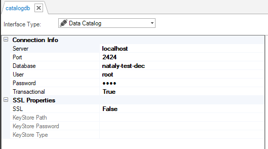

# Data Catalog Setup

The following steps should be performed in order to setup the Fabric for using the Data Catalog.

### Data Catalog Interface Type

Fabric requires the definition of an Interface type = **Data Catalog** for enabling the Data Catalog functionality. It least one interface of this type must be defined in the project  and its name must be **catalogdb**. 

To create a new Data Catalog interface, do the following:

1. Go to **Project Tree** > **Shared Objects**, right click **Interfaces**, select **New Interface** and then select **Data Catalog** from the **Interface Type** dropdown menu to open the **New Interface** window.

   

2. Populate the connection's settings and click **Save**.

#### Connection Settings

<table style="height: 116px;">
<tbody>
<tr style="height: 18px;">
<td style="height: 18px; width: 179px;"><strong>Parameter</strong></td>
<td style="height: 18px; width: 318px;"><strong>Description</strong></td>
</tr>
<tr style="height: 18px;">
<td style="height: 18px; width: 179px;"><strong>Server</strong></td>
<td style="height: 18px; width: 318px;">IP address of the OrientDB server</td>
</tr>
<tr style="height: 18px;">
<td style="height: 18px; width: 179px;"><strong>Port</strong></td>
<td style="height: 18px; width: 318px;">Port</td>
</tr>
<tr style="height: 28px;">
<td style="width: 179px; height: 28px;"><strong>Database</strong></td>
<td style="width: 318px; height: 28px;">OrientDB database name</td>
</tr>
<tr style="height: 18px;">
<td style="height: 18px; width: 179px;"><strong>User</strong>&nbsp;</td>
<td style="height: 18px; width: 318px;">Username</td>
</tr>
<tr style="height: 16px;">
<td style="height: 16px; width: 179px;"><strong>Password&nbsp;</strong></td>
<td style="height: 16px; width: 318px;">Password&nbsp;</td>
</tr>
<tr>
<td style="width: 179px;"><strong>Transactional</strong></td>
<td style="width: 318px;">True/False</td>
</tr>
</tbody>
</table>

### OrientDB

Data Catalog is using OrientDB distributed graph database. OrientDB is an Open Source NoSQL DBMS that combines the power of graphs and the flexibility of documents into one scalable, high-performance operational database.

To setup the OrientDB, do the following:

1. Go to the OrientDB website: https://www.orientdb.org/download and download the **OrientDB with Gremlin Server - zip**.

2. Extract the zip file:

   * For Windows installation: extract the file under **C:\K2View**

3. Edit **orientdb-server-config.xm**l by adding the parameter value 'GREMLIN' as follows:

   ~~~
   <handler class="com.orientechnologies.orient.server.handler.OServerSideScriptInterpreter">
   <parameters>
   <parameter value="true" name="enabled"/>
   <parameter value="SQL,GREMLIN" name="allowedLanguages"/>
   <parameter value="" name="allowedPackages"/>
   </parameters>
   </handler>
   ~~~

4. On the first time you run OrientDB, you will be asked you to create username & password.

5. To run OrientDB:

   * Go to **C:\K2View\orientdb-tp3-3.1.2\orientdb-tp3-3.1.2\bin**.
   * Open CMD and run **server.bat**.

6. Once OrientDB is up and running, you will see the following lines:

   ~~~
   INFO  {db=demodb} Gremlin started correctly [OGremlinServerPlugin]
   INFO  {db=demodb} OrientDB Studio available at http://<yourIP>:2480/studio/index.html [OServer]
   INFO  {db=demodb} OrientDB Server is active v3.1.2 - Veloce (build 8b6ef394ce7b45017e84a65efb9ce7534c56aa8e, branch 3.1.x)
   ~~~

7. Copy the link to the browser to open the OrientDB web application to create a new database.

   * Note that you can also create a new OrientDB database during the definition of your Data Catalog Interface Type by populating the Database setting.

